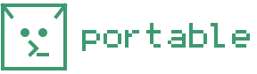

Eine lokale Entwicklungsumgebung für Windows — PHP, Caddy, PostgreSQL, MariaDB,
Redis, Node — die sich **neben** das System setzt statt hinein.

- [Erste Schritte](getting-started.md) — installieren, eine Website ausliefern, eine Datenbank hinzufügen
- [Befehle](commands.md) — jeder Befehl und wofür er da ist
- [Wie es funktioniert](design.md) — die Entscheidungen, die man kennen sollte
- [Wenn etwas schiefgeht](troubleshooting.md) — die wahrscheinlichsten Fehler und was sie bedeuten

## Was „neben dem System“ heißt

Jeder Punkt ist eine Bedingung, unter der das Werkzeug gebaut ist, kein Wunsch:

- **Keine Administratorrechte.** Nicht bei der Installation, nicht im Betrieb, nie.
- **Keine `hosts`-Datei.** Websites sind unter `*.localhost` erreichbar, das
  Windows von sich aus auf die Loopback-Adresse auflöst.
- **Keine Dienste, kein Autostart.** Der Supervisor ist ein Prozess, den Sie
  starten. Er überlebt das Schließen von Terminal und IDE; einen Neustart nicht.
- **Keine Registry, kein PATH, keine Systemverzeichnisse.** Alles liegt in einem
  Verzeichnis. Es zu löschen deinstalliert das Werkzeug vollständig.

Das Ergebnis läuft auf einem abgeriegelten Firmenrechner — also genau dort, wo
Werkzeuge dieser Art sich sonst gar nicht installieren lassen.

## Stand

Im täglichen Einsatz auf echtem Windows: PHP durch den Pool ausliefern, Port 80
als gewöhnlicher Benutzer belegen, das Schließen der Konsole überleben, die
Vollbildansicht, und sich mit `upgrade` selbst ersetzen — Letzteres erst seit
1.3.2: Es bestand monatelang seine Tests, ohne auf einer echten Maschine je
fertig zu werden. Was da los war, steht in der
[Notiz am Ende der Projekt-README](../../README.md).

Eine Einschränkung ist gemessen statt versprochen. Ein Terminal, das Gestartetes
in ein **Job-Objekt ohne Breakaway-Erlaubnis** steckt, nimmt den Supervisor beim
Schließen mit — aus einem solchen Job entkommt auf Prozessebene nichts, weshalb
`portable up` sagt, wenn es in einem steckt. Siehe
[Fehlerbehebung](troubleshooting.md).

macOS und Linux sind keine Ziele. Alle Kataloge lösen Windows-Archive auf; das
Werkzeug läuft dort zwar, installiert aber Binärdateien, die jene Maschine nicht
ausführen kann.
